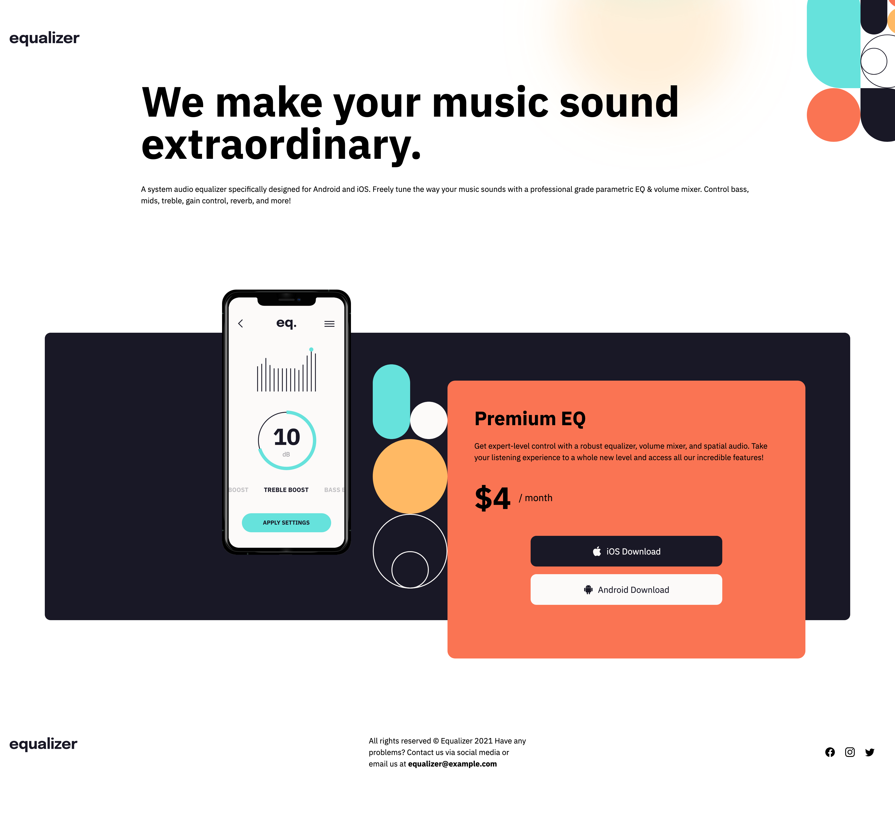
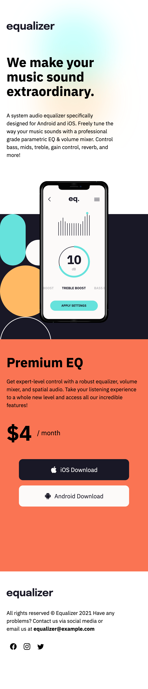

# Frontend Mentor - Equalizer landing page solution

This is a solution to the [Equalizer landing page challenge on Frontend Mentor](https://www.frontendmentor.io/challenges/equalizer-landing-page-7VJ4gp3DE). Frontend Mentor challenges help you improve your coding skills by building realistic projects.

## Table of contents

- [Overview](#overview)
  - [The challenge](#the-challenge)
  - [Screenshot](#screenshot)
  - [Links](#links)
- [My process](#my-process)
  - [Built with](#built-with)
  - [What I learned](#what-i-learned)
  - [Continued development](#continued-development)
- [Author](#author)

## Overview

### The challenge

Users should be able to:

- View the optimal layout depending on their device's screen size
- See hover states for interactive elements

### Screenshot

### Links

- Live Site URL: [https://madroosterlab.github.io/FEM-Equalizer/](https://madroosterlab.github.io/FEM-Equalizer/)

## My process

### Built with

- Semantic HTML5 markup
- SASS
- Flexbox
- Mobile-first workflow

### What I learned

I learned how to use and manipulate SVG files directly added into HTML. I used Bootstrap icons for this project.

### Continued development

I want to fix the footer of the site.

## Author

Jon Avila

- Website - [madroosterlab.com](https://www.madroosterlab.com)
- Frontend Mentor - [@madroosterlab](https://www.frontendmentor.io/profile/madroosterlab)
